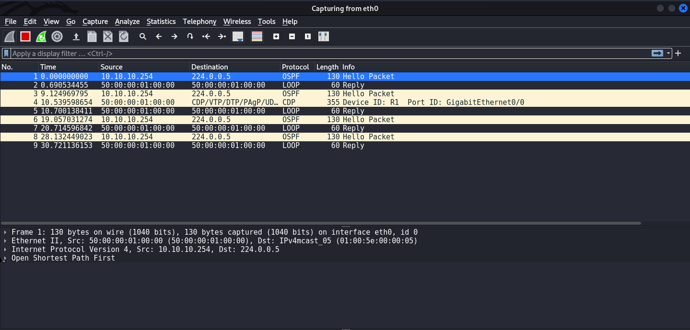
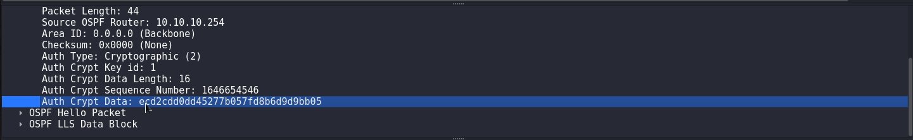
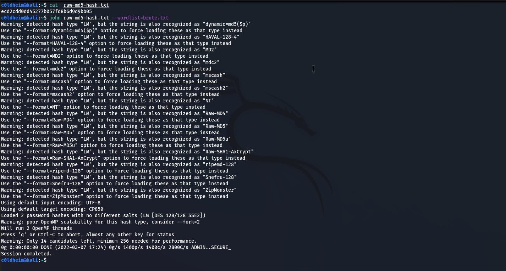
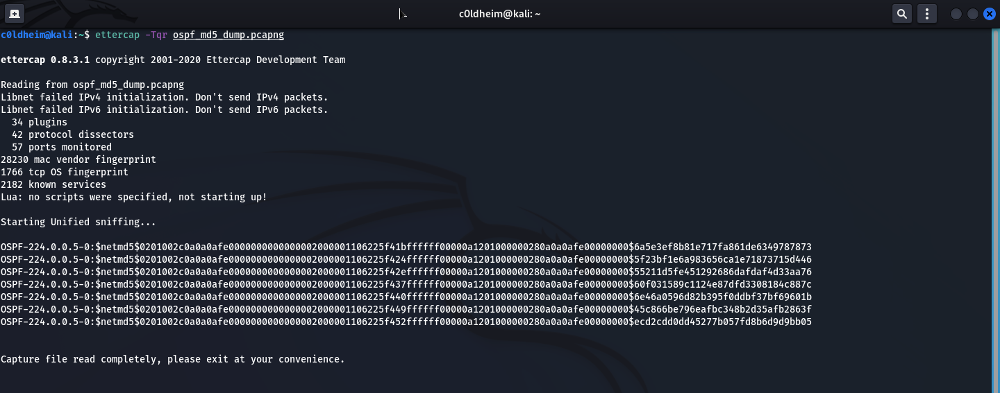
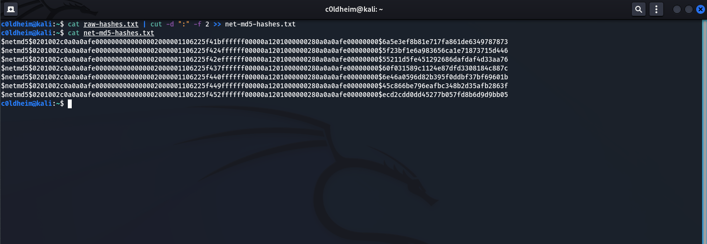
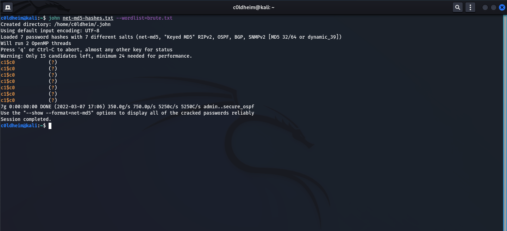
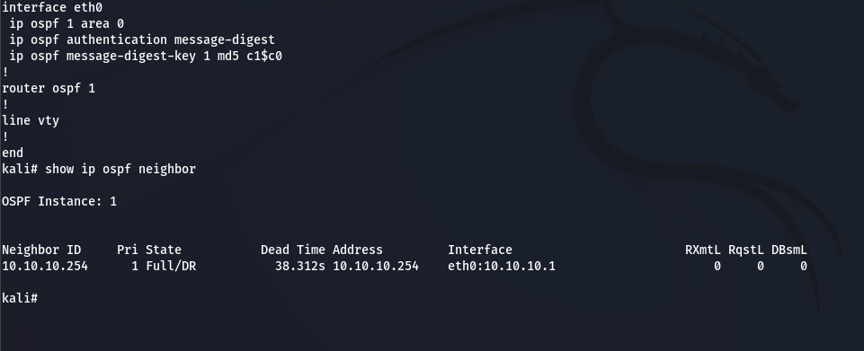

# OSPFMD5Crack

How to crack on OSPF MD5 hash manually

This little guide is for pentesters who conduct a **pentest under a contract**. **Do not use this information to destroy other people's networks.**

**ᛝ**

## 1. Traffic dump

You can open **Wireshark** and capture the traffic. Save it to a **pcapng** file.



## 2. Extracting hashes using Ettercap

Using the **Ettercap**  utility, we will be able to extract net-MD5 hashes from the traffic dump. **OSPF uses net-MD5 hash.** If you copy the hash value from the header **Authentication Crypt Data** and try to crack the password using the brute-force method, nothing will work.





Let's run **Ettercap** in console mode and feed it a traffic dump (a file with the extension **.pcapng**)

```
ettercap -Tqr ospf_md5_dump.pcapng
```



Using the **cut**, we will process the file with the hashes that **Ettercap** gave us.

```
cat raw-hashes.txt | cut -d ":" -f 2 >> net-md5-hashes.txt
```



## 3. Cracking net-MD5 hashes with John

Using **John**, we pass a file with hashes and a dictionary to the input. **(brute-force attack)**

```
john net-md5-hashes.txt --wordlist=brute.txt
```



Let's check the validity of the password and try to connect to the OSPF domain. **Cracked password - c1$c0**



We were able to crack the password from the OSPF domain and connect to the routing domain in **area 0**
